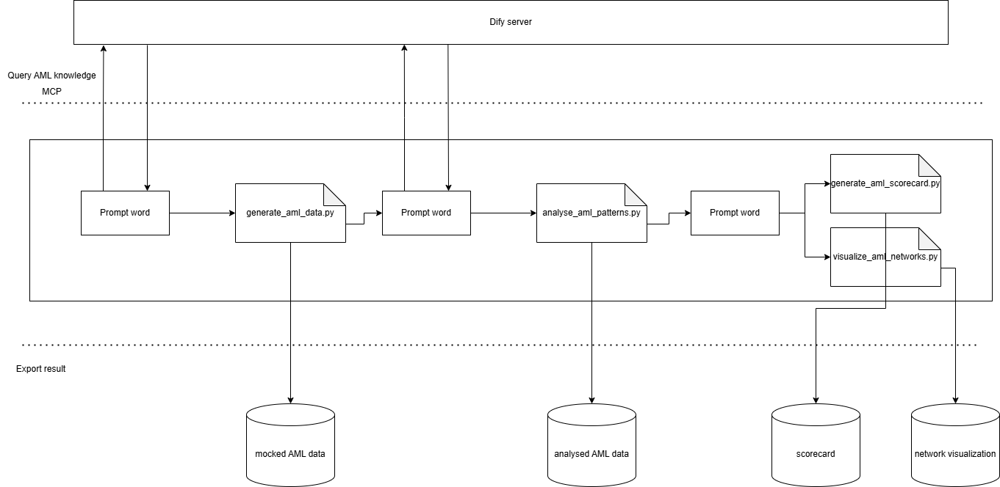

# Graph-based Anti-Money Laundering Analysis with Prompt Engineering (PoC)

A project written with Cursor to utilize the abilities of AI and LLMs to understand complex business scenarios and generate corresponding code. In this use case, it solves complex AML problems through Prompt Engineering.

Technologies include PySpark, GraphFrame, and Data Visualization. The prompts I used are located in the `/prompt` directory. In addition, Dify and MCP are used to better fulfill enterprise use cases: an AML SME can provide domain knowledge in the format of PDF, DOC, or Confluence pages. We set up the knowledge base, agentic workflows, and RAG pipelines on Dify. Afterwards, we provide MCP service to Cursor so that Cursor can query domain knowledge and write better code.

Please note that the prompts may not return 100% accurate results and might need fine-tuning. The model used is Claude Sonnet 4 (thinking).

## Project Overview

This system implements a complete AML (Anti-Money Laundering) detection pipeline, including:
- **Pattern Detection**: Circular transactions, star-pattern splitting, cross-border multi-layer transfers
- **Risk Scoring**: Multi-dimensional rule-based account risk scoring system
- **Visualization**: Interactive network graphs showing money laundering network structures
- **Validation**: Complete detection result verification and performance evaluation

## Project Workflow



### Workflow Description

1. **AI-Enhanced Development**: AML experts provide domain knowledge through Dify knowledge base, which integrates with Cursor IDE via MCP protocol for intelligent code generation
2. **Data Simulation**: Generate realistic AML scenarios with various suspicious patterns
3. **Pattern Analysis**: Use GraphFrame to detect money laundering patterns in transaction networks
4. **Risk Scoring**: Calculate multi-dimensional risk scores for accounts and transactions
5. **Visualization**: Create interactive network graphs showing suspicious transaction patterns
6. **Validation**: Evaluate detection performance with confusion matrices and metrics

## Project Structure

```
spark_aml/
├── src/                           # Source code
│   ├── generate_aml_data.py       # Generate simulated AML data
│   ├── analyse_aml_patterns.py    # GraphFrame pattern detection
│   ├── generate_aml_scorecard.py  # Risk scoring system
│   ├── visualize_aml_networks.py  # Network visualization
│   └── verify_aml_result.py       # Result verification and evaluation
├── result/                        # Detection results and reports
│   └── visualization/             # Interactive HTML visualizations
├── mock_data/                     # Simulated data for testing
├── prompt/                        # Prompt engineering documentation
├── dify/                          # Dify guide
├── .cursor/                       # Cursor IDE configuration (MCP setup)
├── requirements.txt               # Python dependencies
└── README.md                      # Project documentation
```

## Quick Start

### Prerequisites
- Python 3.11
- Apache Spark 3.2.4+
- Java 8/11 (required by Spark)

### Installation

1. **Create virtual environment**
```bash
python -m venv venv
# Windows
venv\Scripts\activate
# Linux/Mac
source venv/bin/activate
```

2. **Install dependencies**
```bash
pip install -r requirements.txt
```

3. **Run complete detection pipeline**
```bash
# 1. Generate simulated data
python src/generate_aml_data.py

# 2. Execute pattern detection
python src/analyse_aml_patterns.py

# 3. Generate risk scores
python src/generate_aml_scorecard.py

# 4. Create visualizations
python src/visualize_aml_networks.py

# 5. Verify detection results
python src/verify_aml_result.py
```

## Core Features

### 1. Money Laundering Pattern Detection
Uses GraphFrame to detect suspicious transaction patterns including circular transactions, star-pattern account splitting, and cross-border multi-layer transfers.

### 2. Risk Scoring System
Multi-dimensional scoring system that evaluates accounts based on geographic risk, transaction patterns, frequency, and detection results.

### 3. Interactive Visualization
Generates interactive HTML network graphs with color-coded nodes and edges, supporting zoom, drag, and hover interactions.

### 4. Knowledge-Enhanced Development
Integrates Dify knowledge base with Cursor IDE through MCP protocol, enabling AI-assisted development with domain expertise.

## Technical Architecture

### Core Technology Stack
- **Apache Spark**: Distributed data processing
- **GraphFrame**: Graph computation and pattern matching
- **Pandas**: Data analysis and processing
- **NetworkX**: Network analysis
- **Vis.js**: Interactive network visualization
- **Dify + MCP**: Knowledge base integration for enhanced AI assistance

### Key Features
- **GraphFrame Pattern Matching**: Uses Cypher-like query syntax for graph pattern detection
- **Distributed Computing**: Supports large-scale data processing
- **Multi-dimensional Scoring**: Considers geographic, temporal, and amount factors
- **Chinese Language Support**: Complete Chinese data processing and display
- **AI-Enhanced Development**: Domain knowledge integration through MCP protocol

## Output Files

### CSV Data Files
- `detected_account.csv`: Account information with detection results, suspicious types, and roles
- `detected_transaction.csv`: Transaction details with detection results and suspicious types
- `high_risk_accounts.csv`: High-risk accounts list with scores above 80

### Report Files
- `verification_report.md`: Detailed performance evaluation report with confusion matrices and metrics
- `risk_alert_report.md`: Risk alert report categorized by risk levels

### Visualization Files
- Interactive HTML network graphs supporting zoom, drag, and information display
- Responsive design supporting different screen sizes
- Three pattern types: circular transactions, star-pattern splitting, cross-border transfers

## Development Environment

This project is optimized for development with Cursor IDE and includes:
- **MCP Integration**: Seamless knowledge base queries during development
- **Chinese Processing**: Full support for Chinese characters and content
- **Auto-execution**: Agent mode for automatic code execution and error resolution
- **Performance Optimization**: Spark configurations for improved processing speed

## License

MIT License

---

**Note**: This project is for educational and research purposes only. Actual implementation should be adjusted and optimized according to specific business scenarios. 