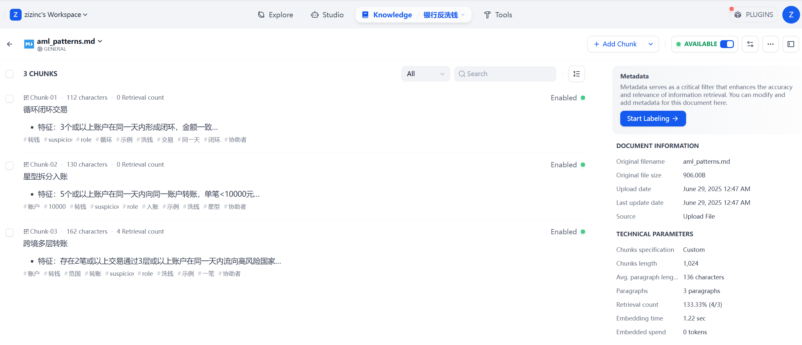
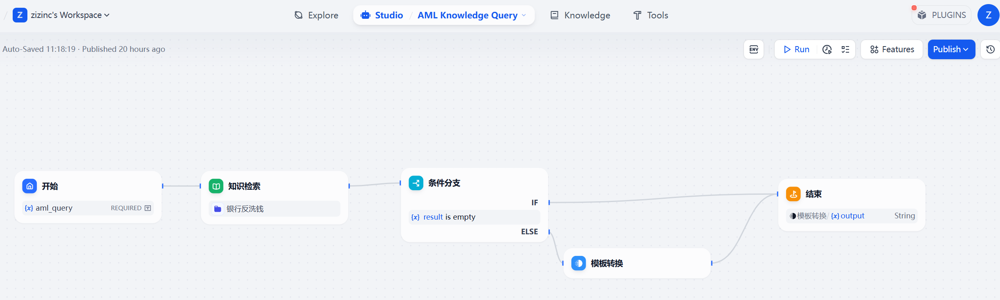
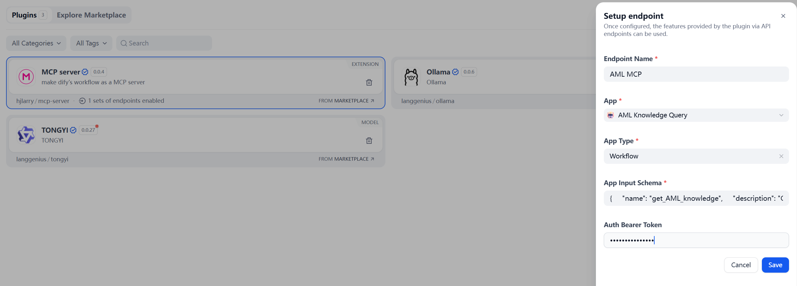
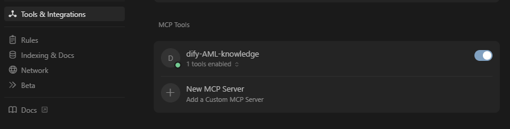
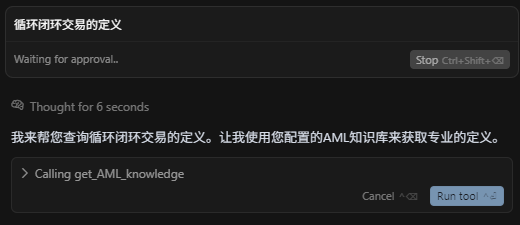

# Setup Local Dify
Follow the guide in https://github.com/langgenius/dify to setup your local Dify

# Create Knowledge
upload aml_patterns.md to Dify's Knowledge


# Create Workflow


# Make Workflow as MCP server
Install hjlarry/mcp-server from Dify's Plugins, create endpoint for the workflow:


App Input Schema
```json
{
    "name": "get_AML_knowledge",
    "description": "Get AML knowledge.",
    "inputSchema": {
        "properties": {
            "aml_query": {"title": "AML query", "type": "string"}
        },
        "required": ["aml_query"],
        "title": "get_amlArguments",
        "type": "object"
    }
}
```

# Setup MCP in Cursor
Replace with the your code below
```json
{
  "mcpServers": {
    "dify-AML-knowledge": {
      "url": "http://localhost/e/2ecxwdk5l85r2s4v/mcp",
      "headers": {
        "Authorization": "Bearer 5Ccp9Eu2QfQikxQ"
      }
    }
  }
} 
```
Make sure your MCP is enabled and has tools enabled

Now you can ask something like "循环闭环交易的定义" and see if Cursor can use MCP tool
