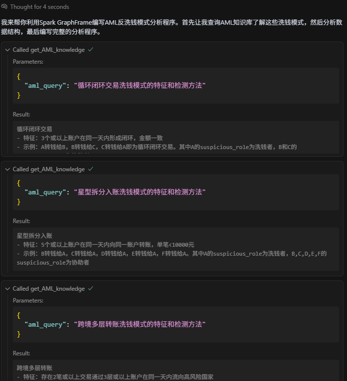

# 生成模拟数据
首先创建venv，确保依赖隔离
请生成一个py脚本模拟银行反洗钱分析的数据集，命名generate_aml_data.py并存到src目录下，需满足以下要求：

**Python依赖要求**
仅使用py库pandas，numpy，random，datetime，faker

**1. 数据规模要求**
- 总账户数：100个左右
- 总交易数：1000条左右（含正常交易和洗钱模式交易）
- 时间范围：2023年1月1日-2023年12月31日

**2. 账户数据字段**
- account_id (唯一标识，8位数字)
- owner_name (中文姓名/公司名)
- registration_date (注册日期，字符串，格式为“YYYY-MM-DD”)
- country (国家，需包含"高危国X")
- is_suspicious (标记是否为洗钱账户，是洗钱者则为true)
- suspicious_type (标记洗钱模式，如果is_suspicious为空那么该值为空)
- suspicious_role (在洗钱过程中扮演什么角色，洗钱者或协助者)

**3. 交易数据字段**
- transaction_id (unique key)
- src_account (转出账户)
- src_account_country (转出账户的国家)
- dst_account (转入账户)
- dst_account_country (转入账户的国家)
- amount (金额，需包含拆分交易)
- currency (货币，统一为CNY)
- value_date (交易日期，字符串，格式为“YYYY-MM-DD hh:mm:ss”)
- is_suspicious (标记是否为参与洗钱的交易)
- suspicious_type (标记洗钱模式，如果is_suspicious为空那么该值为空)

**4. 必须覆盖的洗钱模式**
查询dify-AML-knowledge, 了解并实现以下洗钱模式：
- 循环闭环交易
- 星型拆分入账
- 跨境多层转账

**5. 数据要求**
- 首先生成账户信息，再生成交易信息，确保每个账户和交易都能正确关联上
- 生成洗钱账户和对应的交易时，一个账户最多参与一种洗钱模式和拥有最多一个洗钱角色，并在后面生成序列方便区分，例如循环闭环交易_1,循环闭环交易_2
- 每个洗钱模式至少包含3组示例数据
- 涉及洗钱的交易先后顺序要正确
- 正常交易和洗钱交易应该有差异化，避免后续分析中正常交易被误判成洗钱交易

**6. 输出格式**
模拟数据存储到mock_data目录下：
- 用pandas输出的文件为CSV格式，且用account.csv和transaction.csv命名
- 把洗钱的账户和交易额外输出文件laundering_account.csv和laundering_transaction.csv并按suspicious_type排序方便我检查

# 分析数据
利用Spark GraphFrame，编写适当的分析规则，分析account.csv和transactions.csv并找出符合以下洗钱模式的账号和交易：

**Python依赖要求**
通过以下方式启动Spark和导入GraphFrame
spark = SparkSession.builder \
    .appName("AML Pattern Analysis") \
    .config("spark.jars.packages", "graphframes:graphframes:0.8.2-spark3.2-s_2.12") \
    .config("spark.executor.memory", "4g") \
    .config("spark.driver.memory", "4g") \
    .getOrCreate()

# 确保库已正确安装后再导入
from graphframes import GraphFrame

**洗钱模式**
查询dify-AML-knowledge, 了解并实现以下洗钱模式：
- 循环闭环交易
- 星型拆分入账
- 跨境多层转账
  
**代码注意事项**
 - 只使用GraphFrame，进行分析，例如graph.find("(a)-[e1]->(b); (b)-[e2]->(c); (c)-[e3]->(a)")
 - 循环闭环交易中，注意交易的时间顺序辨别洗钱者和协助者
 - Java环境是1.8
 
**要求**
 - 输出py文件命名为analyse_aml_patterns.py并存储到src目录下
 - 必须使用GraphFrame，不能使用DataFrame进行分析
 - 通过python analyse_aml_patterns.py运行任务
 - 分析完成后，结果存储到result目录下，在account表添加detected_suspicious、detected_suspicious_type和detected_suspicious_role把洗钱账户标注出来，转换Pandas生成csv文件detected_account.csv方便用户在Windows界面校验结果
 - 分析完成后，结果存储到result目录下，在transaction表添加detected_suspicious和detected_suspicious_type把涉及洗钱的交易标注出来，转换Pandas生成csv文件detected_transaction.csv方便用户在Windows界面校验结果
  
  **截图**
  

# 校验分析结果
根据detected_account.csv和detected_transaction.csv:
- 根据suspicious_type,suspicious_role和detected_suspicious_type,detected_suspicious_role，统计每种洗钱场景的正确率和召回率
- 统计true positive，true negative，false positive和false negative的比例
生成verify_aml_result.py并存到src目录下，脚本输出markdown校验报告并存储到result/verification_report.md

# 数据可视化
根据detected_account.csv和detected_transaction.csv:
- 根据detected_suspicious，detected_suspicious_type,detected_suspicious_role，对数据进行可视化，生成资金链路网络
- 账户为node，账户之间的交易为边，边需要注明方向和金额
- node之间确保有足够的空间，避免都聚到一起
- 生成html网页，让用户可以一定程度和数据互动
- 按洗钱场景分别生成网络，所以期望一共会生成三个网页，对应循环闭环交易、星型拆分入账和跨境多层转账
- 注意需要把洗钱者的所以交易都包含进来，涉及洗钱场景的交易进行高亮方便区分
结果存储到result/visualization目录下

# 生成评分卡
根据detected_account.csv和detected_transaction.csv构建评分卡，命名generate_aml_scorecard.py，规则如下:
- 如果账户属于高危国家，加40分
- 如果账户不属于高危国家但是有交易涉及另一个账户是高危国家的，每有一条加10分，最高40分
- 如果账户和超过4个另外的国家有交易且金额超过5万，加20分；如果账户和超过6个另外的国家有交易且金额超过10万，加40分
- 如果账户在同一天交易超过10条且金额超过5万，加15分；如果账户在同一天交易超过20条且金额超过10万，加30分；
- 根据detected_suspicious，detected_suspicious_type,detected_suspicious_role，如果检测到是洗钱者加100分，是协助者加50分

导出评分超过80的账户数据，并从大到小排序，需要注明分数是怎么构成的，文件csv格式。
对于触发了洗钱场景的账户我们需要发出预警，生成一份md文件报告，按分数大小排序，报告里列明账户被发出预警的原因，交易方都有哪些，分数是怎么构成的